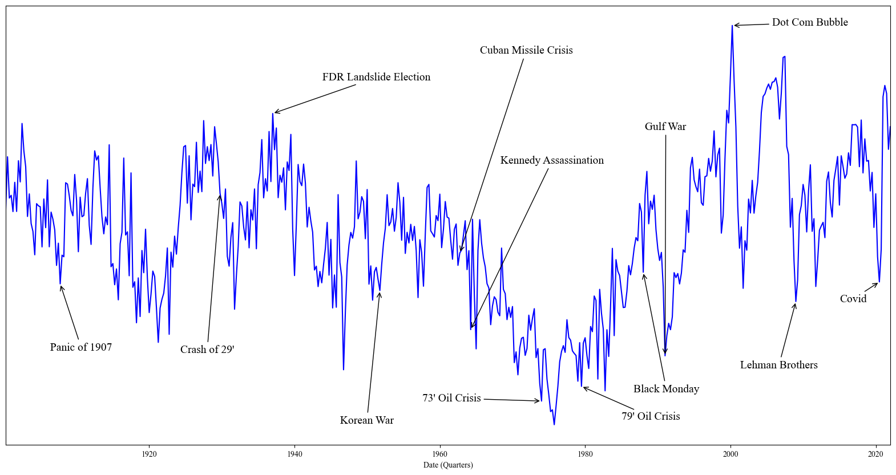

I will be joining the Chicago Booth School of Business as an assistant professor of finance this summer.

I am a 5th year PhD candidate in financial economics at the Yale School of Management.  Much of my work leverages machine learning and natural language processing to address key questions in economics and finance.  My current focus is on developing measures of beliefs with applications to asset pricing and behavioral economics.

before Yale, I was a researcher at Booth, received a master's degree in statistics from the University of Michigan, and completed my undergraduate degree in economics at the University of Chicago.

Education
=========
---
* Ph.D. in Financial Economics, Yale School of Management
* M.S. in Statistics, University of Michigan, 2017
* B.A. in Economics, University of Chicago, 2013

Job Market Paper
================
---
**1. The Ghost in the Machine: Generating Beliefs with Large Language Models**\
This version: December 2023\
  \[<a href="#/" onclick="visib('LLM')">Abstract</a>\] \[[PDF](../files/LLM.pdf)\]\
Finalist for *BlackRock Applied Research Award*\
Subsumes *[Surveying Generative AI's Economic Expectations](https://papers.ssrn.com/sol3/papers.cfm?abstract_id=4430515)*

I introduce a methodology to generate economic expectations by applying large language models to historical news.  Leveraging this methodology, I make three key contributions.  (1) I show generated expectations closely match existing survey measures and capture many of the same deviations from full-information rational expectations.  (2) I use my method to generate 120 years of economic expectations from which I construct a measure of economic sentiment capturing systematic errors in generated expectations.  (3) I then employ this measure to investigate behavioral theories of bubbles.  Using a sample of industry-level run-ups over the past 100 years, I find that an industry's exposure to economic sentiment is associated with a higher probability of a crash and lower future returns.  Additionally, I find a higher degree of feedback between returns and sentiment during run-ups that crash, consistent with return extrapolation as a key mechanism behind bubbles.
 

Publications
============
---
**2. Business News and Business Cycles**\
   (with [Bryan Kelly](https://www.bryankellyacademic.org/), [Asaf Manela](https://asafmanela.github.io/), and [Dacheng Xiu](https://dachxiu.chicagobooth.edu/))\
   Forthcoming at *Journal of Finance*\
   This version: April 2023\
    \[<a href="#/" onclick="visib('BNBC')">Abstract</a>\]   \[[PDF](../files/BNBC.pdf)\] \[[NBER](https://www.nber.org/papers/w29344)\] \[[SSRN](https://papers.ssrn.com/sol3/papers.cfm?abstract_id=3446225)\] \[[Data](http://structureofnews.com/)\]

We propose an approach to measuring the state of the economy via textual analysis of business news. From the full text of 800,000 Wall Street Journal articles for 1984–2017, we estimate a topic model that summarizes business news into interpretable topical themes and quantifies the proportion of news attention allocated to each theme over time. News attention closely tracks a wide range of economic activities and explains 25% of aggregate stock market returns. A text-augmented VAR demonstrates the large incremental role of news text in modeling macroeconomic dynamics. We use this model to retrieve the narratives that underlie business cycle fluctuations.
 

**3. Narrative Asset Pricing: Interpretable Systematic Risk Factors from News Text**\
   (with [Bryan Kelly](https://www.bryankellyacademic.org/) and [Yinan Su](https://www.suyinan.com/))\
   *Review of Financial Studies*\
   This version: May 2023\
   \[<a href="#/" onclick="visib('narrativeAP')">Abstract</a>\] \[[PDF](../files/narrative_AP.pdf)\] \[[RFS](https://doi.org/10.1093/rfs/hhad042)\] \[[SSRN](https://papers.ssrn.com/sol3/papers.cfm?abstract_id=3895277)\] \[[Code](https://github.com/lbybee/regipca)\] \[[Data](https://dataverse.harvard.edu/dataset.xhtml?persistentId=doi:10.7910/DVN/VIWCTK)\]

We estimate a narrative factor pricing model from news text of The Wall Street Journal. Our empirical method integrates topic modeling (LDA), latent factor analysis (IPCA), and variable selection (group lasso). Narrative factors achieve higher out-of-sample Sharpe ratios and smaller pricing errors than standard characteristic-based factor models and predict future investment opportunities in a manner consistent with the ICAPM. We derive an interpretation of the estimated risk factors from narratives in the underlying article text.
 

**4. Change-point Computation for Large Graphical Models: A Scalable Algorithm for Gaussian Graphical Models with Change-points**\
    (with [Yves Atchadé](https://math.bu.edu/people/atchade/))\
    *Journal of Machine Learning Research*\
    This version: January 2018\
      \[<a href="#/" onclick="visib('GCP')">Abstract</a>\] \[[PDF](../files/GCP.pdf)\] \[[JMLR](https://www.jmlr.org/papers/volume19/17-218/17-218.pdf)\] \[[Code](https://cran.r-project.org/web/packages/changepointsHD/index.html)\]

Graphical models with change-points are computationally challenging to fit, particularly in cases where the number of observation points and the number of nodes in the graph are large. Focusing on Gaussian graphical models, we introduce an approximate majorize- minimize (MM) algorithm that can be useful for computing change-points in large graphical models. The proposed algorithm is an order of magnitude faster than a brute force search. Under some regularity conditions on the data generating process, we show that with high probability, the algorithm converges to a value that is within statistical error of the true change-point. A fast implementation of the algorithm using Markov Chain Monte Carlo is also introduced. The performances of the proposed algorithms are evaluated on synthetic data sets and the algorithm is also used to analyze structural changes in the S&P 500 over the period 2000-2016.
 

Working Papers
==============
---

**5. Asset Pricing with Narrative Churn**\
   (with Hongyu Wu)\
   This version: October 2023\
   \[<a href="#/" onclick="visib('churn')">Abstract</a>\]

   Why do some assets earn higher returns than others? Why are markets so volatile? The CAPM's failure and excess volatility are two of the central puzzles in asset pricing. We propose a new explanation for these puzzles that we term narrative churn: the events or "narratives" that drive asset price variation are constantly changing. By estimating local penalized regressions using textual embeddings extracted from conference call transcripts, we show that (1) narrative churn can explain three times the cross-sectional variation in expected returns as the best static explanations over our sample, (2) narrative churn explains a significantly larger proportion of time-series variation than benchmark models. Finally, we show how our method can be used to decompose the narratives which drive returns to better understand the origins of these puzzles.
 

**6. Associative Memory is Machine Learning**\
   (with [Tianshu Lyu](https://www.tianshulyu.com/))\
   This version: September 2023\
   \[<a href="#/" onclick="visib('MLmemory')">Abstract</a>\]

    We document a relationship between memory-based models of beliefs and a general class of kernel methods from the statistics and machine learning literature. Motivated by this relationship, we propose a new form of memory-based beliefs which aligns more closely with the state of the art in the machine learning literature. We explore this approach empirically by introducing a measure of "narrative memory" -- similarity between states of the world based on similarity in narrative representations of those states. Using textual embeddings extracted from conference call transcripts, we show that our estimates of memory-based beliefs explain variation in errors in long-term growth forecasts of IBES analysts. We conclude by discussing implications of this relationship for the literature on memory-based models of beliefs.
 

**7. Macro-based Factors for the Cross-Section of Currency Returns**\
    (with Leandro Gomes and Joao Valente)\
    This version: May 2023\
      \[<a href="#/" onclick="visib('mIPCA')">Abstract</a>\] \[[PDF](../files/mIPCA.pdf)\] \[[SSRN](https://papers.ssrn.com/sol3/papers.cfm?abstract_id=4400205)\] \[[Code](https://github.com/bkelly-lab/ipca)\]

We use macroeconomic characteristics and exposures to Carry and Dollar as instruments to estimate a latent factor model with time-varying betas with the instrumented principal components analysis (IPCA) method by Kelly et al. (2020). On a pure out-of-sample basis, this model can explain up to 78% of cross-sectional variation of a Global panel of currencies excess returns, compared to only 27.9% for Dollar and Carry and 51% for a static PCA model. The latent factor and time-varying exposures are directly linked to macroeconomic fundamentals. The most relevant are exports exposures to commodities and US trade, credit over GDP, and interest rate differentials. This model, therefore, sheds light on how to incorporate macroeconomic fundamentals to explain time-series and cross-section.
 

Code & Data
===========
---
- [regIPCA](https://github.com/lbybee/regipca)

    A penalized implementation of instrumented principal components analysis in Python.

- [The Structure of Economic News](http://structureofnews.com/)

    Data and summaries for the 180 topics estimated for *Business News and Business Cycles*.

    

- [DiSTL](https://github.com/lbybee/DiSTL)

    A collection of efficient Gibbs sampling implementations for latent Dirichlet allocation in Python.

- [glVAR](https://github.com/lbybee/glVAR)

   A fast method for group lasso vector autoregression in Python.

- [labbot](https://github.com/lbybee/labbot)

    A set of Python decorators useful for iterative development of research code.

- [IPCA](https://github.com/bkelly-lab/ipca)

    A Python implementation of instrumented principal components analysis (with [Matthias Buchner](https://www.mbuechner.com/)).

- [statsmodels](https://github.com/statsmodels/statsmodels)

    I contributed the distributed estimation procedure of Lee et al. (2015) for penalized estimators.

- [changepointsHD](https://cran.r-project.org/web/packages/changepointsHD/index.html)

    An R implementation of a simulated annealing algorithm for change-point detection.

[//]: This java script is the button to show abstract

